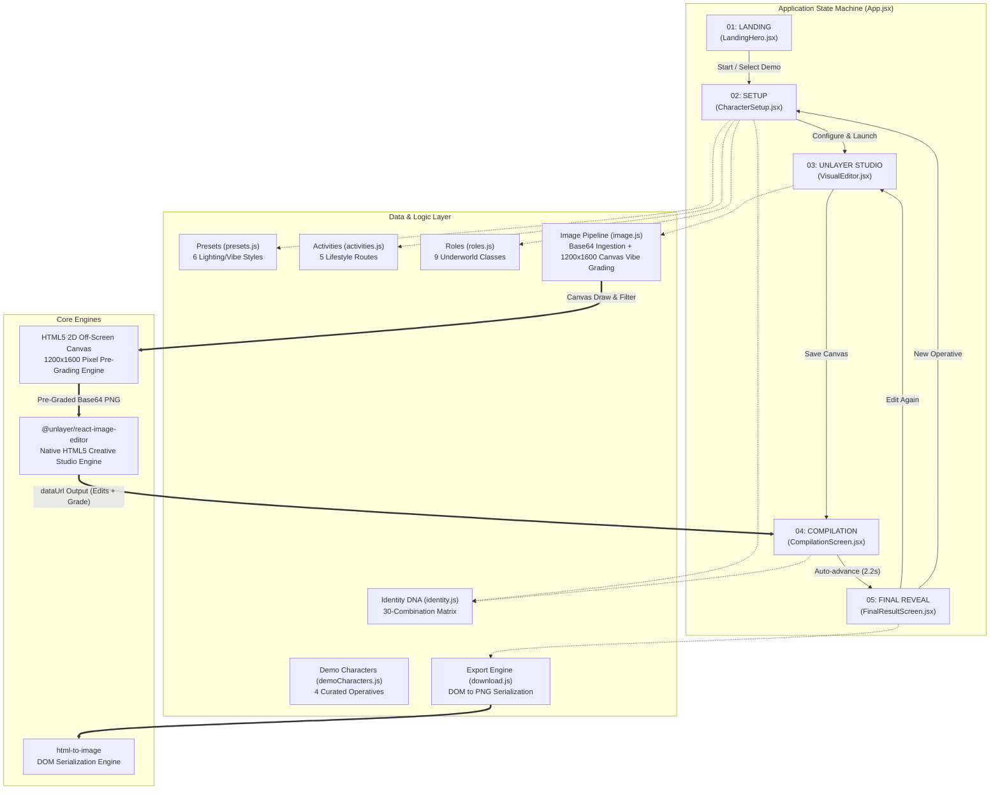
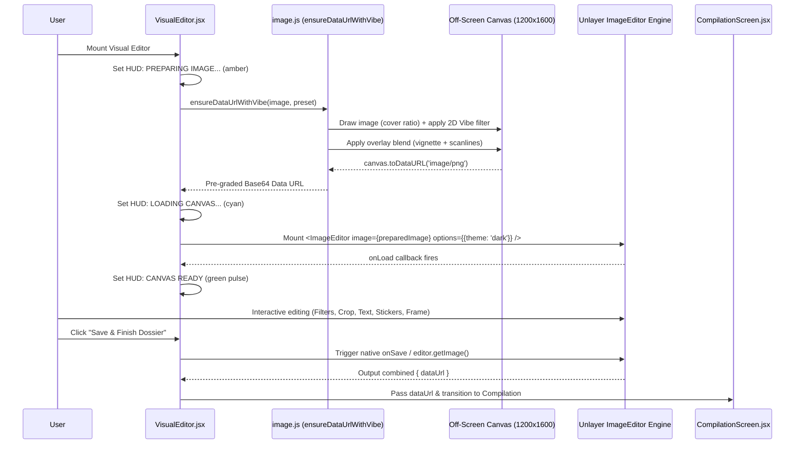
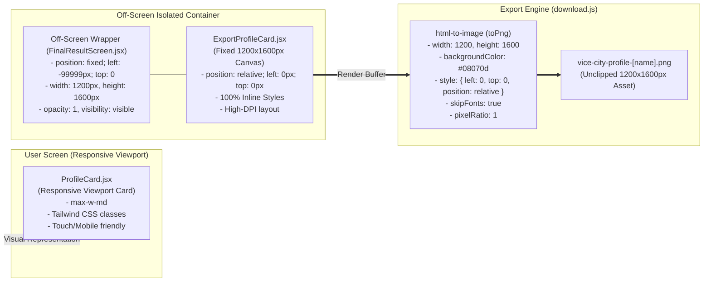

# Architecture & Technical Design

**Project**: Vice City Character Studio  
**Target**: Unlayer Build with React Image Editor Challenge (`#BuiltWithImageEditor`)  
**Deployment**: [https://vice-city-character-studio.vercel.app/](https://vice-city-character-studio.vercel.app/)  
**Repository**: [https://github.com/Viidhii19/vice-city-character-studio](https://github.com/Viidhii19/vice-city-character-studio)  

---

## 1. Executive Summary & Architectural Vision

**Vice City Character Studio** is a client-side React 18 single-page application (SPA) built for the **Unlayer Build with React Image Editor Challenge**. It immerses the user into an authentic, neon-lit GTA VI / Vice City underworld identity creation studio.

Rather than treating the image editor as an isolated utility widget, the architecture positions [`@unlayer/react-image-editor`](https://www.npmjs.com/package/@unlayer/react-image-editor) as the **central creative engine** of the experience:

$$\text{Operative Identity} + \text{Vibe Preset} + \text{Lifestyle Route} + \mathbf{Unlayer\ Visual\ Calibration} = \mathbf{Final\ Street\ Dossier}$$

### Architectural Principles
1. **Visual Causality & Pixel Transformation**: User selections do not merely toggle metadata. Selecting a Vibe preset physically transforms the image pixels before the Unlayer editor mounts via an off-screen HTML5 Canvas pipeline (`ensureDataUrlWithVibe`).
2. **Unlayer as Hero**: The user's pre-graded portrait is customized using real Unlayer canvas tools (crop, filters, stickers, text, shapes, frames). The edited visual is preserved as the high-resolution hero asset in the final compiled dossier.
3. **User Choice $\rightarrow$ Visible Consequence (Identity DNA)**: Every aesthetic selection (vibe, route, role) deterministically shapes the operative's archetype, badge styles, and dossier metadata through a 30-combination matrix.
4. **100% Client-Side & Zero-Secret Architecture**: Zero backend dependencies, zero API keys, zero tracking cookies, zero external database vulnerabilities. 
5. **Deterministic High-Resolution Export**: High-fidelity 1200×1600px PNG generation using DOM serialization (`html-to-image`) decoupled from viewport scaling, responsive breakpoints, or scroll position.
6. **Cinematic Emotional Progression**: Step transitions are intentionally designed to make the final dossier feel earned, climaxing in a 2.2-second compilation sequence.

---

## 2. High-Level System Architecture



---

## 3. Application State Machine & Lifecycle

The application operates as a deterministic finite-state machine managed at the root component ([`App.jsx`](file:///c:/Users/admin/Desktop/GTA/src/App.jsx)). Navigation is state-driven, maintaining clean routing without requiring server-side hydration or external router packages.

### State Transitions Table

| Current Screen | User Action | Next Screen | Side Effects / Payload |
|---|---|---|---|
| `landing` | Click "Create Your Operative" | `setup` | Scrolls viewport to top `(0, 0)` |
| `landing` | Click Quick Demo Card (Mia, Alex, etc.) | `editor` | Sets operative model with demo preset; navigates straight to Unlayer Studio |
| `setup` | Click "Back" | `landing` | Preserves currently configured operative in memory |
| `setup` | Click "Calibrate Visual with Unlayer" | `editor` | Commits `character` state; validates operative name/alias; triggers canvas grading |
| `editor` | Click "Back" / "Choose Another Image" | `setup` | Returns to setup with character fields intact |
| `editor` | Click "Reset" | `editor` | Reverts Unlayer canvas to pre-graded base image |
| `editor` | Click "Save & Finish Dossier" | `compilation` | Captures canvas base64 Data URL into `editedImage`; activates 2.2s compilation timer |
| `compilation` | Auto-timer (2200ms) completion | `result` | Advances to final dossier display; triggers confetti celebration |
| `result` | Click "Edit Visual Again" | `editor` | Re-opens Unlayer editor with pre-graded base portrait |
| `result` | Click "Create Another Operative" | `setup` | Clears `editedImage`; retains base defaults |
| `*` (Header) | Click Logo or "Reset" | `landing` | Full application reset to default operative |

---

## 4. The Operative Data Model & Identity DNA

### 4.1 Operative State Structure
The central `character` entity is maintained in `App.jsx` and distributed down the component tree:

```typescript
interface CharacterModel {
  name: string;        // Operative legal/known name (e.g., 'Mia Santos')
  alias: string;       // Street handle (e.g., 'Apex')
  role: string;        // Selected role: 'Hacker' | 'Street Racer' | 'Fixer' | etc.
  preset: string;      // Vibe ID: 'neon-nights' | 'ocean-drive' | 'downtown-heat' | etc.
  activity: string;    // Lifestyle route: 'cruise-city' | 'hang-docks' | 'ride-jetski' | etc.
  image: string;       // Image source (local asset path, Data URL, or upload)
  bio: string;         // Lore & background summary
  heat: number;        // Heat rating (1 to 5 stars)
  cred: number;        // Street reputation (0 to 100%)
  cash: number;        // Liquid bounty / bankroll in USD
}
```

### 4.2 Identity DNA Matrix (`identity.js`)
To reinforce the core principle **"USER CHOICE $\rightarrow$ VISIBLE CONSEQUENCE"**, the system pairs the user's selected **Vibe Preset** with their chosen **Lifestyle Route** through a deterministic 30-entry archetype matrix:

$$\text{Vibe (6 Presets)} \times \text{Activity (5 Routes)} = \mathbf{30\ Unique\ Identity\ Archetypes}$$

Examples of derived DNA:
- `neon-nights` + `cruise-city` $\rightarrow$ **CHROME PHANTOM**
- `after-dark` + `cruise-city` $\rightarrow$ **CYBER NOIR RUNNER**
- `ocean-drive` + `ride-jetski` $\rightarrow$ **WAVE RUNNER**
- `downtown-heat` + `hang-docks` $\rightarrow$ **HARBOR ENFORCER**
- `sunset-boulevard` + `visit-deli` $\rightarrow$ **BOULEVARD INSIDER**
- `backstreet` + `hit-gym` $\rightarrow$ **YARD IRON**

The derived identity archetype is dynamically stamped onto:
1. The **Live Setup Preview** (`ProfileCard.jsx`)
2. The **Cinematic Compilation Sequence** (`CompilationScreen.jsx`)
3. The **Climax Screen Dossier** (`FinalResultScreen.jsx`)
4. The **High-Res 1200×1600px Export Card** (`ExportProfileCard.jsx`)

### 4.3 Deterministic Serial Number Generation
Every card displays a unique verification serial (e.g., `VC-4821`). To ensure consistency across views and exports without requiring a central database:
- A stable 32-bit hash is calculated from the operative's name, alias, and role.
- The hash maps deterministically to an integer in the range `[1000, 9999]`.
- The identical serial appears synchronously across the live preview, compilation screen, and exported PNG.

---

## 5. Unlayer React Image Editor Core Pipeline

The visual transformation architecture is built as a **two-stage pipeline**:

1. **Stage 1 (Pre-Processing Canvas Engine)**: Physical pixel grading via `ensureDataUrlWithVibe()`.
2. **Stage 2 (Creative Canvas Engine)**: User customization using [`@unlayer/react-image-editor`](https://www.npmjs.com/package/@unlayer/react-image-editor).



### 5.1 Stage 1: Off-Screen Canvas Pre-Processing (`ensureDataUrlWithVibe`)
To solve the architectural flaw where presets only updated metadata, `ensureDataUrlWithVibe` physically alters the source image pixels prior to mounting Unlayer:
- **CORS Bypass**: Converts the source URL into an in-memory base64 Data URL.
- **Aspect Ratio Normalization**: Initialized at fixed `1200×1600` resolution using geometric `object-fit: cover` math to eliminate distortion.
- **Vibe Context Filters**:
  - `neon-nights`: `contrast(1.25) saturate(1.6) hue-rotate(-25deg)`
  - `ocean-drive`: `sepia(0.35) saturate(1.45) brightness(1.1) contrast(1.05)`
  - `downtown-heat`: `contrast(1.35) sepia(0.4) saturate(0.85) brightness(0.95)`
  - `after-dark`: `brightness(0.75) contrast(1.4) hue-rotate(180deg) saturate(1.2)`
  - `sunset-boulevard`: `saturate(1.7) brightness(1.05) hue-rotate(15deg) contrast(1.1)`
  - `backstreet`: `grayscale(0.75) contrast(1.5) brightness(0.9)`
- **Atmospheric Overlays**: Subtle radial vignette and 1.5px scanlines blended via `ctx.globalCompositeOperation = 'overlay'`.

### 5.2 Stage 2: Native Unlayer Image Editor
The pre-graded base image mounts directly into Unlayer's canvas:
- **Native Suite**: Unlayer provides authentic cropping, resizing, color adjustments, text layers, stickers, and frame tools.
- **Tri-State Lifecycle HUD**:
  1. `PREPARING IMAGE...` (Amber pulse): Off-screen canvas grading running.
  2. `LOADING CANVAS...` (Cyan pulse): Mounting Unlayer canvas instance.
  3. `CANVAS READY` (Neon green pulse): Fired on `onLoad`; editor is fully interactive.
- **Dual-Save Fail-Safe**:
  - Primary: Native `onSave({ dataUrl, blob })` callback from Unlayer.
  - Fallback: Programmatic `editorRef.current.editor.getImage()` call on save button click.

---

## 6. Cinematic Compilation Engine

When the user finishes editing in Unlayer, the app moves into [`CompilationScreen.jsx`](file:///c:/Users/admin/Desktop/GTA/src/components/CompilationScreen.jsx). This full-screen modal transition lasts **2.2 seconds** and acts as an emotional bridge between editing and final delivery.

### 3-Phase Progression

```
Time:     0ms                   450ms                   1300ms                  2200ms
Phase:    [Phase 0: Scanning]   [Phase 1: Compiling]    [Phase 2: Verified]     [Transition]
Action:   - Concentric spinners - Vibe & District rows  - Energy & DNA rows     - Mount
          - "SCANNING VISUAL..."- Ambient glow active   - ShieldCheck icon        FinalResultScreen
                                                        - "IDENTITY COMPILED"
```

1. **Phase 0 (0 – 450ms)**: Concentric neon counter-rotating spinners activate with the user's vibe-specific accent color. Status: `SCANNING VISUAL IDENTITY...`.
2. **Phase 1 (450 – 1300ms)**: Operative metadata rows fade in sequentially (`VIBE`, `DISTRICT`, `ROUTE`). Status: `COMPILING DOSSIER...`.
3. **Phase 2 (1300ms+)**: Final cryptographic verification rows appear (`ENERGY`, `IDENTITY DNA`, `SERIAL`). The spinner center transitions to a `ShieldCheck` icon. Status: `IDENTITY COMPILED`.

---

## 7. High-Resolution 1200×1600px Export Architecture

Exporting a responsive DOM node directly often introduces defects: mobile scaling shrinks text, CSS transforms clip drop shadows, and external web fonts can cause layout shifts.

To achieve studio-quality output, the architecture implements a **Decoupled Dual-Card Paradigm**:



### Key Technical Defenses in `ExportProfileCard.jsx` & `download.js`
- **Zero Tailwind Class Reliance**: Uses 100% inline CSS objects (`style={{...}}`). This ensures that `html-to-image` never encounters unresolved utility classes or media queries.
- **Fixed Dimensions**: Hard-coded to `width: 1200px` and `height: 1600px`.
- **Decoupled Off-Screen Mounting**: The wrapper container is mounted with `position: fixed; left: -99999px; top: 0; opacity: 1; visibility: visible;`. The card itself has `position: relative; left: 0px; top: 0px;`. This ensures that when `html-to-image` clones the card, the element is centered at `(0, 0)` inside the SVG foreignObject, avoiding negative-offset clipping and black export bugs.
- **Forced Style Reset**: `downloadElementAsPng` passes explicit override rules in `exportOptions.style`:
  ```javascript
  style: {
    left: '0px',
    top: '0px',
    position: 'relative',
    transform: 'none',
    opacity: '1',
    visibility: 'visible',
    display: 'flex',
  },
  backgroundColor: '#08070d',
  ```
- **Automated Fallback**: In [FinalResultScreen.jsx](file:///c:/Users/admin/Desktop/GTA/src/components/FinalResultScreen.jsx), `handleDownload` falls back to `cardRef.current` if `exportRef.current` ever encounters an unexpected browser exception.
- **`skipFonts: true` Guard**: Cross-origin web font stylesheets can throw `SecurityError` during canvas font embedding. Font metrics are preserved using fallback font stacks.
- **Synchronized Edited Asset**: Dynamically receives `resolvedImage` from the Unlayer editor session, guaranteeing that all user filters, stickers, text overlays, and crops appear on the exported card.

---

## 8. Design System & Theming Architecture

The styling system combines **Tailwind CSS 3** with custom synthwave CSS utilities ([`src/index.css`](file:///c:/Users/admin/Desktop/GTA/src/index.css)):

### 8.1 Color Tokens & Accents

| Token Name | Hex Code | Purpose |
|---|---|---|
| Deep Obsidian | `#08070d` | Base application background |
| Studio Dark | `#0b0a12` | Unlayer canvas & card frame background |
| Vice Neon Pink | `#ff2a85` | Primary CTA, brand highlights, active badges |
| Cyber Cyan | `#00f0ff` | Secondary accents, terminal text, HUD details |
| Miami Purple | `#8a2be2` | Radial ambient glow, gradient midtones |
| Sunset Gold | `#ffd000` | Warning badges, stars, cash indicators |
| Emerald Green | `#00ff88` | Verification badges, canvas ready indicator |

### 8.2 Dynamic Vibe Presets System

Each of the 6 vibes defines a unique visual identity token set ([`src/data/presets.js`](file:///c:/Users/admin/Desktop/GTA/src/data/presets.js)):

```javascript
{
  id: 'neon-nights',
  name: 'Neon Nights',
  accent: '#ff2a85',        // Primary highlight
  secondary: '#00f0ff',     // Dual-tone accent
  glow: 'rgba(255,42,133,0.35)',
  badgeBg: 'bg-[#ff2a85]/15 text-[#ff5ea7] border-[#ff2a85]/30',
  location: 'Ocean Beach & Washington Ave',
  filterAdvice: 'Try high contrast, vibrant magenta/cyan tones, or retro CRT glow.',
}
```

The active vibe's color tokens are dynamically injected into ambient backlights, spinners, badges, and card borders across all screens.

---

## 9. Security, Performance & Deployment Architecture

### 9.1 Static Deployment & Zero-Backend Footprint
The application compiles into pure static HTML, CSS, and JavaScript bundles via Vite:
- **Vercel**: Configured via [`vercel.json`](file:///c:/Users/admin/Desktop/GTA/vercel.json) with SPA rewrites (`"rewrites": [{"source": "/(.*)", "destination": "/"}]`).
- **Netlify**: Configured via [`public/_redirects`](file:///c:/Users/admin/Desktop/GTA/public/_redirects) (`/* /index.html 200`).
- **Cloudflare Pages / GitHub Pages**: Compatible out-of-the-box with standard static serving.

### 9.2 Zero Secrets & Threat Model
- **No API Keys**: Does not use external third-party generative AI, database endpoints, or authenticated microservices.
- **No Local Storage Leaks**: State is held in React component memory; refreshing provides a clean state reset.
- **Client-Side File Ingestion**: Custom user uploads are processed strictly in-memory via browser `URL.createObjectURL` and `FileReader`. No user photos are ever transmitted over the network.
- **XSS Mitigation**: File uploads are validated via `validateImageFile` for MIME type (`image/*`) and file size limits (15 MB maximum).

---

## 10. Summary Matrix

| Capability | Implementation Mechanism | Key File |
|---|---|---|
| **State Machine** | Single root state with 5 declarative screens | [`src/App.jsx`](file:///c:/Users/admin/Desktop/GTA/src/App.jsx) |
| **Visual Causality** | 1200×1600 Canvas pixel grading & 2D Vibe filters | [`src/lib/image.js`](file:///c:/Users/admin/Desktop/GTA/src/lib/image.js) |
| **Image Editor** | Official `@unlayer/react-image-editor` integration | [`src/components/VisualEditor.jsx`](file:///c:/Users/admin/Desktop/GTA/src/components/VisualEditor.jsx) |
| **CORS Guard** | Pre-conversion of image sources to base64 Data URLs | [`src/lib/image.js`](file:///c:/Users/admin/Desktop/GTA/src/lib/image.js) |
| **Identity DNA** | Deterministic 30-combination Vibe × Route matrix | [`src/lib/identity.js`](file:///c:/Users/admin/Desktop/GTA/src/lib/identity.js) |
| **Compilation** | 2.2s multi-phase cinematic transition | [`src/components/CompilationScreen.jsx`](file:///c:/Users/admin/Desktop/GTA/src/components/CompilationScreen.jsx) |
| **1200×1600 Export** | Off-screen DOM node serialization via `html-to-image` | [`src/components/ExportProfileCard.jsx`](file:///c:/Users/admin/Desktop/GTA/src/components/ExportProfileCard.jsx) |
| **Design System** | Tailwind CSS + Cyber Synthwave neon tokens | [`src/index.css`](file:///c:/Users/admin/Desktop/GTA/src/index.css) |
| **Build & Bundle** | Vite 5 with Rollup code-splitting | [`vite.config.js`](file:///c:/Users/admin/Desktop/GTA/vite.config.js) |
